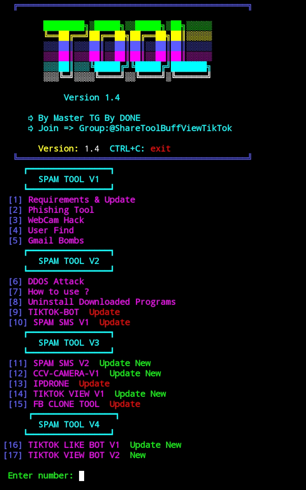

## SMM Version 3
https://github.com/mastertgtool/SMM_TOOL_KH.git
    
  </a>

# How to Install
```sh
pkg install git
```
```sh
git clone https://github.com/mastertgtool/SMM_TOOL_KH_V3.git
```
```sh
cd SMM_TOOL_KH_V3
```
```sh
bash SMM.sh
```
 
# Tools I Use

